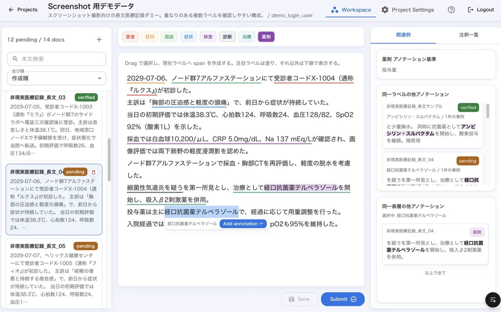

# Layered Span Studio

Layered Span Studio は、文字列の任意区間に対して、重なり合う複数ラベルを同時に管理する作業に最適化されたアノテーションツールである。主な特徴は次の通り。

- 重なり合うラベルを前提にした UI/UX を採用し、複数 span を直感的に編集可能。
- アノテーションの定義情報や、他の既存アノテーションを即座で確認でき、効率的なアノテーション作業が可能。
- LLM 連携を見据えたAPIを提供しており、半自動アノテーションの組込が可能。




---

## 目次

1. [クイックスタート](#クイックスタート)
2. [クイックスタート時の画面イメージ（スクリーンショット）](#クイックスタート時の画面イメージスクリーンショット)
3. [リポジトリ構成](#リポジトリ構成)
4. [実装していること（機能）](#実装していること機能)
5. [開発環境と実行手順（後続で記載）](#開発環境と実行手順後続で記載)
6. [開発方針](#開発方針)
7. [ドキュメント連携](#ドキュメント連携)
8. [トラブル対応のメモ](#トラブル対応のメモ)
9. [導入・改善のための連絡](#導入改善のための連絡)
10. [License](#license)

## クイックスタート

クイックスタートとして、デモプロジェクトを読み込む前提で手順をまとめる。

以下は2つのターミナルで並行して実行する想定。

1. バックエンドを起動する

```bash
cd backend
export JWT_SECRET='dev-secret'
uv sync
uv run scripts/create_user.py demo_login_user demo_login_pass
uv run uvicorn layered_span_studio_backend.main:app --host 127.0.0.1 --port 8000 --reload
```

2. フロントエンドを起動する

```bash
cd ../frontend
npm install
npm run dev
```

3. ブラウザで `http://127.0.0.1:5173` (フロントの出力を確認すること) を開き、ログイン後にデモプロジェクトを import する

- ユーザー名: `demo_login_user`
- パスワード: `demo_login_pass`
- プロジェクト一覧右上の `Import Project` から `docs/quickstart-demo-project.json` を選択
- import 完了後、作成されたプロジェクトが開くのでアノテーション画面を確認する

4. すぐ確認できるポイント
- ドラッグでアノテーションができる。
- テキストに対して重なり合うラベルを付与することが可能。
- 右ペインで既存アノテーションや定義情報を確認
- 選択中の表層テキストに対して、別docにある既存アノテーションを確認可能
- shortcut で操作が可能 (? ボタンで確認)


## リポジトリ構成

（本文は後で追記）

## 実装していること（機能）

（本文は後で追記）

## 開発環境と実行手順（後続で記載）

（本文は後で追記）

## 開発方針

（本文は後で追記）

## ドキュメント連携

（本文は後で追記）

## トラブル対応のメモ

（本文は後で追記）

## 導入・改善のための連絡

（本文は後で追記）

## License

Licensed under the Apache License, Version 2.0. See [LICENSE](LICENSE) for details.
